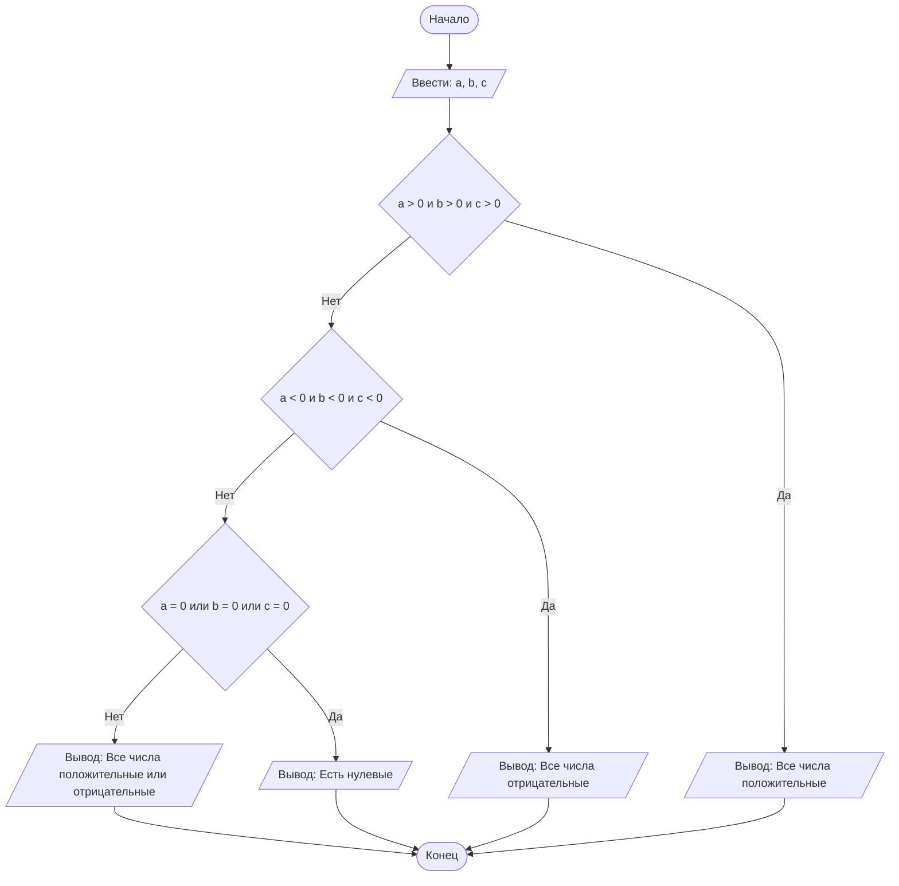

#### Отчет по лабораторной работе № 1

#### № группы: ПМ-2501

#### Выполнила: Бизина Юлиана Кирилловна

#### Вариант: 2

### Cодержание:

- Постановка задачи
- Входные и выходные данные
- Выбор структуры данных
- Алгоритм
- Программа
- Анализ правильности решения

### 1. Постановка задачи

> На вход программы подаются три целых числа A, B, C. Необходимо вывести одно из следующих сообщений в зависимости от значений чисел:
> «Все числа положительные», если все три числа больше нуля.
> «Все числа отрицательные», если все три числа меньше нуля.
> «Все числа положительные или отрицательные», если среди чисел есть как положительные, так и отрицательные.
> «Есть нулевые», если хотя бы одно из чисел равно нулю.

В данной задаче нужно рассмотреть 4 случая: 

    1. A и B и C > 0; 
    2. A и B и С < 0;  
    3. A или B или C = 0;  
    4. A и B и C != 0 и A, B, C не одного знака. 

### 2. Входные и выходные данные

#### Данные на вход

На вход программа должна получать 3 числа, в условии сказано, что числа целые.

|             | Тип                |
|-------------|--------------------|
| A (Число 1) | Целое число        |
| B (Число 2) | Целое число        |
| С (Число 3) | Целое число        |

#### Данные на выход

Программа должна вывести текстовую фразу.

|         | Тип                                |
|---------|------------------------------------|
| Текст   | Строка                             |

### 3. Выбор структуры данных

Программа получает 3 целых числа, поэтому для их хранения
можно выделить 3 переменных (`a`, `b` и `c`) типа `int`.

|             | название переменной | Тип (в Java) | 
|-------------|---------------------|--------------|
| A (Число 1) | a                 | int        |
| B (Число 2) | b                 | int        |
| C (Число 2) | c                 | int        | 

Для вывода результата необязательно его хранить в отдельной переменной.

### 4. Алгоритм

#### Алгоритм выполнения программы:

1. Ввод данных:  
   Программа считывает три целых числа, обозначенные как a, b и c.

2. Сравнение чисел:  
   Программа сравнивает значения a, b и c. Если a, b, c больше нуля, программа завершает работу и выводит текстовое сообщение на экран. Если нет, программа переходит к следующему шагу и проверяет числа на следующее условие: если a, b, c меньше нуля, программа завершает работу и выводит текст на экран, если нет, начинается проверка дальнейшего условия. Если хоть одно из чисел a, b, c равно нулю - выводится текстовое сообщение и программа завершается. Иначе выводится другое текстовое сообщение и работа завершается.

3. Вывод результата:  
   На экран выводится текстовое сообщение о введенных числах.

#### Блок-схема



### 5. Программа

```java
import java.util.Scanner;
// Импортируем класс Scanner для работы с вводом данных
public class Main {
    public static void main(String[] args) {
        // Создаем объект Scanner для чтения данных с клавиатуры
        Scanner scanner = new Scanner(System.in);
        // Выводим инструкцию для пользователя
        System.out.print("Введите три числа через пробел: ");
        // Читаем три последовательных целых числа из одной строки
        int a = scanner.nextInt(); // Первое число
        int b = scanner.nextInt(); // Второе число
        int c = scanner.nextInt(); // Третье число
        // Проверяем, все ли числа положительные, используя логическийоператор И (&&) - условие выполнится только если ВСЕ числа > 0
        if (a > 0 && b > 0 && c > 0) {
            // Выводим сообщение о том, что все числа положительные
            System.out.print("Все числа положительные");
        }
        else {
            // Проверяем, все ли числа отрицательные, используя логический оператор ИЛИ (||) - условие выполнится только если ВСЕ числа < 0
            if (a < 0 && b < 0 && c < 0) {
                // Выводим сообщение о том, что все числа отрицательные
                System.out.print("Все числа отрицательные");
            }
            else {
                // Проверяем, есть ли среди чисел нулевые значения
                // Используем логический оператор ИЛИ (||) - условие выполнится если хотя бы одно число равно 0
                if (a == 0  b == 0  c == 0) {
                    // Выводим сообщение о наличии нулевых чисел
                    System.out.print("Есть нулевые");
                }
                else { // Все остальные случаи - когда есть как положительные, так и отрицательные числа, но нет нулевых, так как эта проверка идет раньше)
                    // Выводим сообщение о смешанных положительных и отрицательных числах
                    System.out.print("Все числа положительные или отрицательные");
                    }
                }
            }
        }
    }
```
### 6. Анализ правильности решения

Программа работает корректно на всем множестве решений с учетом ограничений.

1. Тест на `A > 0 и B > 0 и C > 0`:

    - **Input**:
        
        5 3 24
        
    - **Output**:
        
        Все числа положительные
        
2. Тест на `A < 0 и B < 0 и C < 0`:

    - **Input**:
        
        -2 -11 -56
        
    - **Output**:
        
        Все числа отрицательные
        
3. Тест на `A = 0 или B = 0 или С = 0`:

    - **Input**:
        
        0 8 -6
        
    - **Output**:
        
        Есть нулевые
        
4. Тест на `A > 0 или A < 0` и `B > 0 или B < 0` и `C > 0 или C < 0`:

    - **Input**:
        
        -6 4 -10
        
    - **Output**:
        
        Все числа положительные или отрицательные
        
 ```
